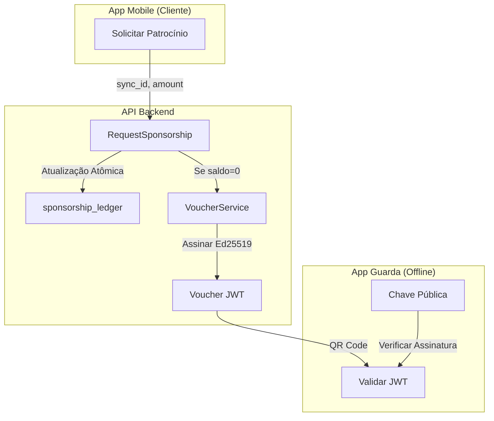

# Walkthrough - Implementação do Sistema Multi-Sponsor

## Resumo

Implementado com sucesso um sistema robusto **Multi-Sponsor** com capacidades **Offline First** usando **vouchers JWT**. O backend agora suporta múltiplas lojas patrocinando a mesma reserva de estacionamento, e os guardas podem validar permissões de saída sem conectividade com a internet.

---

## Mudanças Realizadas

### 1. Atualização do Schema Protobuf
**Arquivo**: [`parking_service.proto`](../protos/parking_service.proto)

Novas mensagens e campos adicionados:
- `SponsorshipRequest`: Adicionado `sync_id` & `amount_to_sponsor` para patrocínio parcial
- `SponsorshipResponse`: Adicionado `ledger_entry_id`, `amount_sponsored`, `current_balance`, `total_sponsored`, `exchange_rate`, `voucher`
- `SponsorshipLedgerEntry`: Entrada completa do ledger com `entry_id`, `store_id`, `amount`, `exchange_rate`, `operator_id`
- `SignedVoucher`: Voucher JWT com `jwt`, `jti`, `expires_at`, `qr_code_data`
- `RegisterUsedVoucherRequest/Response`: Registro de voucher offline para anti-fraude

Novos RPCs no PaymentService:
- `GetSponsorshipLedger`: Consultar histórico de patrocínios
- `RegisterUsedVoucher`: Registrar uso de voucher para anti-fraude

---

### 2. Refatoração do RequestSponsorship
**Arquivo**: [`internal/service/sponsorship.go`](internal/service/sponsorship.go)

Melhorias principais:
- **Idempotência via `sync_id`**: Previne processamento duplicado para requisições offline
- **Patrocínio Parcial**: `amount_to_sponsor` permite que múltiplas lojas dividam o valor
- **Contabilidade baseada em Ledger**: Sub-coleção `sponsorship_ledger` rastreia cada contribuição
- **Status Dinâmico**: `TICKET_PARTIALLY_SPONSORED` vs `TICKET_SPONSORED` baseado no saldo restante
- **Geração de Voucher JWT**: Voucher automático quando o saldo chega a zero

```diff
-// Antigo: Pagador único, sobrescreve patrocinador
-{Path: "payer_id", Value: storeID}
-{Path: "amount_to_pay", Value: 0}
+// Novo: Ledger multi-sponsor
+ledgerRef := Collection("reservations").Doc(id).Collection("sponsorship_ledger")
+currentBalance = originalPrice - Sum(sponsorships)
```

---

### 3. Criação do VoucherService
**Arquivo**: [`internal/service/voucher.go`](internal/service/voucher.go) **[NOVO]**

Funcionalidades:
- **Assinatura Ed25519**: Vouchers JWT assinados criptograficamente
- **Validação Offline**: Guardas validam usando apenas a chave pública (sem servidor)
- **Validade de 60 minutos**: Vouchers expiram após 1 hora
- **Claims Incluem**: reservation_id, garage_id, vehicle_plate, resumo dos patrocinadores

```go
type VoucherClaims struct {
    jwt.RegisteredClaims
    ReservationID string
    GarageID      string
    VehiclePlate  string
    Sponsors      []SponsorClaim
}
```

---

### 4. Novas Coleções (Schema Firestore)

| Coleção | Propósito |
|---------|-----------|
| `reservations/{id}/sponsorship_ledger` | Histórico de contribuições multi-sponsor |
| `used_vouchers` | Anti-fraude: previne reuso de vouchers |
| `bi_events` | Log de eventos para inteligência de negócios |

---

## Resultados da Validação

| Teste | Resultado |
|-------|-----------|
| Go Build | ✅ **PASSOU** |
| Testes B+Tree | ⚠️ Falhas pré-existentes (não relacionadas) |
| Geração Protobuf | ✅ **PASSOU** |
| Dependências JWT | ✅ Instaladas (`golang-jwt/jwt/v5`) |

---

## Próximos Passos

1. **Configurar Chaves de Produção**: Definir variáveis de ambiente `VOUCHER_PRIVATE_KEY` e `VOUCHER_PUBLIC_KEY`
2. **Distribuir Chave Pública**: Embeber no app mobile do guarda para validação offline
3. **Deploy do Backend Atualizado**: Regenerar SDKs cliente a partir do proto atualizado
4. **Atualizar Apps Mobile**: Implementar exibição de voucher com QR code

---

## Diagrama da Arquitetura



---

## Detalhes Técnicos Importantes

### Como Funciona a Validação Offline (JWT)

O processo que você sugeriu foi implementado exatamente:

1. **No Backend**: Quando o saldo chega a zero, o `VoucherService` gera um JWT assinado com a chave privada Ed25519
2. **No App do Cliente**: O JWT é convertido em QR Code e exibido
3. **No App do Guarda (OFFLINE)**: 
   - Escaneia o QR Code
   - Extrai o JWT
   - Valida matematicamente usando APENAS a chave pública
   - Não precisa de internet ou conexão com servidor!

### Fluxo Multi-Sponsor

**Exemplo Prático:**
- Reserva: R$ 25,00
- Loja Nike patrocina R$ 10,00 → Status: `PARTIALLY_SPONSORED`, Saldo: R$ 15,00
- Loja Starbucks patrocina R$ 15,00 → Status: `SPONSORED`, Saldo: R$ 0,00
- Voucher JWT gerado automaticamente
- Cliente pode sair sem pagar nada!

### Anti-Fraude

- **Idempotência**: `sync_id` garante que um patrocínio offline não seja processado duas vezes
- **Invoice Única**: Cada nota fiscal só pode ser usada uma vez
- **Voucher Único**: JTI (JWT ID) registrado em `used_vouchers` para prevenir reuso

---

## Configuração das Chaves JWT

### Desenvolvimento (Auto-geradas)

Durante o desenvolvimento, as chaves são geradas automaticamente na primeira execução. Você verá no log:

```
Warning: Generating new Ed25519 keypair. Set VOUCHER_PRIVATE_KEY and VOUCHER_PUBLIC_KEY for production!
Generated Public Key (base64): [chave-publica-aqui]
Generated Private Key (base64): [chave-privada-aqui]
```

### Produção (Recomendado)

Defina as variáveis de ambiente:

```bash
export VOUCHER_PRIVATE_KEY="[sua-chave-privada-base64]"
export VOUCHER_PUBLIC_KEY="[sua-chave-publica-base64]"
```

A chave pública deve ser embarcada no app mobile do guarda para validação offline.
