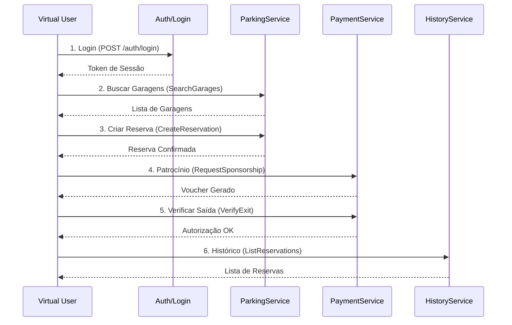

# Especificação de Teste de Carga e Desempenho
## ParkingZero - Sistema de Estacionamento Inteligente

**Versão:** 1.0.0  
**Data:** 30/01/2026  
**Autor:** QA Team  
**Status:** ✅ Pronto para Execução

---

## 1. Visão Geral

Este documento especifica os testes de carga e desempenho para a API do ParkingZero, um sistema de gestão de estacionamento com patrocínio de lojas parceiras.

### 1.1 Objetivos

- Validar a capacidade do sistema sob carga de **1.000 usuários simultâneos**
- Identificar gargalos de performance em endpoints críticos
- Medir latência de operações sensíveis (entrada/saída de veículos)
- Verificar resiliência do sistema sob pico de carga
- Determinar o ponto de ruptura (breaking point)

### 1.2 Escopo

| Componente | Incluído | Observações |
|------------|----------|-------------|
| API gRPC (ParkingService) | ✅ | Endpoints de reserva, busca, entrada/saída |
| API gRPC (PaymentService) | ✅ | Patrocínio, verificação de saída |
| Health Check HTTP | ✅ | Endpoints de monitoramento |
| Mobile App (Flutter) | ❌ | Fora do escopo |
| Firestore | ✅ | Monitoramento indireto via Circuit Breaker |
| B+Tree Local | ✅ | Latência crítica em operações de veículos |

---

## 2. Arquitetura sob Teste

```
┌─────────────────────────────────────────────────────────────────┐
│                       LOAD TEST AGENTS                          │
│                    (k6 / ghz / Go Benchmarks)                   │
└─────────────────────────┬───────────────────────────────────────┘
                          │ gRPC (port 8080)
                          ▼
┌─────────────────────────────────────────────────────────────────┐
│                      BACKEND API (Go)                           │
│  ┌─────────────────┐  ┌─────────────────┐  ┌─────────────────┐  │
│  │ ParkingService  │  │ PaymentService  │  │ VehicleService  │  │
│  │  (gRPC)         │  │  (gRPC)         │  │  (gRPC)         │  │
│  └────────┬────────┘  └────────┬────────┘  └────────┬────────┘  │
│           │                    │                    │           │
│  ┌────────▼────────────────────▼────────────────────▼────────┐  │
│  │                    Auth Interceptor (RBAC)                │  │
│  └────────┬────────────────────┬────────────────────┬────────┘  │
│           │                    │                    │           │
│           ▼                    ▼                    ▼           │
│  ┌─────────────────┐  ┌─────────────────┐  ┌─────────────────┐  │
│  │   Firestore     │  │  Circuit Breaker │  │   B+Tree Local  │  │
│  │   (Cloud)       │  │   (Resiliência)  │  │   (< 10ms)      │  │
│  └─────────────────┘  └─────────────────┘  └─────────────────┘  │
└─────────────────────────────────────────────────────────────────┘
                          │ HTTP (port 8081)
                          ▼
                 ┌─────────────────┐
                 │  Health Checks  │
                 │  /health        │
                 │  /health/sync   │
                 │  /health/ready  │
                 └─────────────────┘
```

---

## 3. Fluxo de Teste

### 3.1 Cenário Principal: Fluxo Completo do Usuário



### 3.2 Especificação por Endpoint

#### 3.2.1 Login (/auth/login)

| Atributo | Valor |
|----------|-------|
| **Método** | POST (simulado via gRPC metadata) |
| **Payload Válido** | `{ "email": "teste@usuario.com", "password": "senhaSegura123" }` |
| **Payload Inválido** | `{ "email": "inexistente@test.com", "password": "errada" }` |
| **Resposta Esperada (Válido)** | Status 200, Token válido |
| **Resposta Esperada (Inválido)** | Status 401 |
| **SLA Latência** | P95 < 200ms |

#### 3.2.2 Reserva de Vaga (CreateReservation)

| Atributo | Valor |
|----------|-------|
| **Serviço** | ParkingService.CreateReservation |
| **Payload** | `{ "user_id": "<id>", "garage_id": "<id>", "vehicle_plate": "ABC1234", "start_time": <unix_ts>, "end_time": <unix_ts> }` |
| **Resposta Esperada (Válido)** | Status OK, Reservation ID |
| **Resposta Esperada (Inválido)** | Status INVALID_ARGUMENT (400) |
| **SLA Latência** | P95 < 400ms |

#### 3.2.3 Pagamento/Patrocínio (RequestSponsorship)

| Atributo | Valor |
|----------|-------|
| **Serviço** | PaymentService.RequestSponsorship |
| **Métodos Válidos** | "pix", "credit_card", "sponsorship" |
| **Métodos Inválidos** | "bitcoin", "cash", "" |
| **Resposta Esperada (Válido)** | Status OK, Voucher JWT |
| **Resposta Esperada (Inválido)** | Status INVALID_ARGUMENT (400) |
| **SLA Latência** | P95 < 500ms |

#### 3.2.4 Histórico (ListReservations)

| Atributo | Valor |
|----------|-------|
| **Serviço** | ParkingService.ListReservations |
| **Autenticação** | Requer Token de Sessão |
| **Resposta Esperada** | Lista de Reservations |
| **SLA Latência** | P95 < 300ms |

#### 3.2.5 Entrada de Veículo (RecordVehicleEntry) ⚠️ CRÍTICO

| Atributo | Valor |
|----------|-------|
| **Serviço** | ParkingService.RecordVehicleEntry |
| **Armazenamento** | B+Tree Local (latência crítica) |
| **SLA Latência** | **P95 < 50ms** |
| **Observações** | Operação síncrona, não pode depender de rede |

#### 3.2.6 Saída de Veículo (RecordVehicleExit) ⚠️ CRÍTICO

| Atributo | Valor |
|----------|-------|
| **Serviço** | ParkingService.RecordVehicleExit |
| **Armazenamento** | B+Tree Local (latência crítica) |
| **SLA Latência** | **P95 < 50ms** |
| **Observações** | Calcula valor a pagar |

---

## 4. Cenários de Carga

### 4.1 Teste de Carga Padrão (Standard)

```
Perfil de Carga:
    │
VUs │                    ┌────────────────────┐
    │                   /                      \
1000├──────────────────┤                        ├────
    │                 /                          \
 500├────────────────┤                            ├──
    │               /                              \
 100├──────────────┤                                ├
    │             /                                  \
   0├────────────┴────────────────────────────────────┴──
    0s         30s      60s       90s     120s     150s
    
    Ramp-up    Peak Load  Sustained    Ramp-down
```

| Parâmetro | Valor |
|-----------|-------|
| VUs Máximo | 1.000 |
| Duração Total | 2 minutos 30 segundos |
| Ramp-up | 0 → 100 → 500 → 1000 VUs (30s) |
| Carga Sustentada | 1000 VUs (60s) |
| Ramp-down | 1000 → 0 VUs (30s) |

### 4.2 Teste de Pico (Spike)

| Parâmetro | Valor |
|-----------|-------|
| Base | 100 VUs |
| Pico | 2.000 VUs (súbito) |
| Duração do Pico | 30 segundos |
| Objetivo | Verificar recuperação após pico |

### 4.3 Teste de Estresse (Stress)

| Parâmetro | Valor |
|-----------|-------|
| Fases | 500 → 1000 → 1500 → 2000 VUs |
| Duração por Fase | 5 minutos |
| Objetivo | Encontrar ponto de ruptura |

### 4.4 Teste de Resistência (Soak) - Opcional

| Parâmetro | Valor |
|-----------|-------|
| VUs | 500 (constante) |
| Duração | 4 horas |
| Objetivo | Detectar memory leaks, degradação |

---

## 5. Métricas Coletadas

### 5.1 Métricas de Latência

| Métrica | Descrição | Threshold |
|---------|-----------|-----------|
| `http_req_duration` | Tempo total de resposta | P95 < 500ms |
| `avg` | Tempo médio | < 200ms |
| `p50` | Percentil 50 (mediana) | < 150ms |
| `p95` | Percentil 95 | < 500ms |
| `p99` | Percentil 99 | < 1000ms |
| `max` | Tempo máximo | < 5000ms |

### 5.2 Métricas de Throughput

| Métrica | Descrição | Target |
|---------|-----------|--------|
| `http_reqs` | Requisições por segundo | > 500 RPS |
| `iterations` | Fluxos completos por segundo | > 100/s |

### 5.3 Métricas de Erro

| Métrica | Descrição | Threshold |
|---------|-----------|-----------|
| `http_req_failed` | Taxa de falha | < 1% |
| `checks` | Validações OK | > 99% |

### 5.4 Métricas por Endpoint

| Endpoint | Tag | Threshold P95 |
|----------|-----|---------------|
| Health Check | `endpoint:health` | < 100ms |
| Login | `endpoint:login` | < 200ms |
| Buscar Garagens | `endpoint:search_garages` | < 300ms |
| Criar Reserva | `endpoint:create_reservation` | < 400ms |
| Patrocínio | `endpoint:request_sponsorship` | < 500ms |
| Verificar Saída | `endpoint:verify_exit` | < 150ms |
| Histórico | `endpoint:list_reservations` | < 300ms |
| **Entrada Veículo** | `endpoint:vehicle_entry` | **< 50ms** |
| **Saída Veículo** | `endpoint:vehicle_exit` | **< 50ms** |

### 5.5 Métricas de Infraestrutura (Monitoramento)

| Métrica | Fonte | Threshold |
|---------|-------|-----------|
| Circuit Breaker State | `/health/sync` | CLOSED |
| Queue Size | `/health/sync` | < 1000 |
| Consecutive Failures | `/health/sync` | < 3 |

---

## 6. Critérios de Aprovação (Pass/Fail)

### 6.1 Critérios Obrigatórios (Must Pass)

| Critério | Threshold | Prioridade |
|----------|-----------|------------|
| Taxa de Sucesso Global | ≥ 99% | 🔴 Crítico |
| P95 Latência Global | < 500ms | 🔴 Crítico |
| P95 Entrada/Saída Veículo | **< 50ms** | 🔴 Crítico |
| Circuit Breaker | Não pode abrir | 🔴 Crítico |
| Servidor Disponível | 100% uptime | 🔴 Crítico |

### 6.2 Critérios Desejáveis (Should Pass)

| Critério | Threshold | Prioridade |
|----------|-----------|------------|
| P99 Latência Global | < 1000ms | 🟡 Importante |
| Throughput | > 500 RPS | 🟡 Importante |
| Queue Size Máximo | < 500 | 🟡 Importante |

### 6.3 Critérios Informativos

| Critério | Observação |
|----------|------------|
| Ponto de Ruptura | Documentar VUs onde performance degrada |
| Tempo de Recuperação | Documentar tempo para normalizar após pico |
| Consumo de Recursos | Monitorar CPU/Memória se disponível |

---

## 7. Ambiente de Teste

### 7.1 Requisitos de Infraestrutura

| Componente | Especificação |
|------------|---------------|
| Agentes k6 | Mínimo 4 vCPUs, 8GB RAM |
| Rede | Latência < 10ms para servidor |
| Servidor Backend | Mesmo ambiente de produção (ou equivalente) |
| Firestore | Projeto de teste separado |

### 7.2 Pré-Requisitos

- [ ] Servidor backend rodando na porta 8080 (gRPC)
- [ ] Health check respondendo na porta 8081 (HTTP)
- [ ] Firestore configurado e acessível
- [ ] k6 instalado nos agentes de teste
- [ ] Dados de teste seedados (garagens, usuários)

### 7.3 Configuração do Ambiente

```powershell
# Variáveis de ambiente
$env:BASE_URL = "http://localhost:8080"
$env:HEALTH_URL = "http://localhost:8081"
$env:GRPC_URL = "localhost:8080"
$env:ENVIRONMENT = "test"
```

---

## 8. Execução

### 8.1 Comandos de Execução

```powershell
# Teste rápido de validação (smoke test)
cd load-tests
.\scripts\run-all-tests.ps1 -TestType smoke

# Teste de carga padrão (1000 VUs)
.\scripts\run-all-tests.ps1 -TestType standard

# Teste de pico
.\scripts\run-all-tests.ps1 -TestType spike

# Teste de estresse
.\scripts\run-all-tests.ps1 -TestType stress

# Todos os testes
.\scripts\run-all-tests.ps1 -TestType all
```

### 8.2 Execução Manual com k6

```powershell
# Com configuração customizada
k6 run --vus 500 --duration 60s k6/scenarios/full-flow.js

# Com relatório JSON
k6 run --out json=reports/results.json k6/scenarios/full-flow.js
```

### 8.3 Benchmarks Go

```powershell
cd load-tests/grpc
go test -bench=. -benchmem -benchtime=10s
```

---

## 9. Análise de Resultados

### 9.1 Relatórios Gerados

| Relatório | Formato | Localização |
|-----------|---------|-------------|
| Resumo k6 | JSON | `reports/*.json` |
| Análise HTML | HTML | `reports/analysis_report.html` |
| Benchmarks Go | Texto | Console |

### 9.2 Análise Automatizada

```powershell
.\scripts\analyze-results.ps1
```

### 9.3 Checklist de Análise

- [ ] P95 de todos os endpoints dentro do SLA?
- [ ] Taxa de sucesso ≥ 99%?
- [ ] Circuit Breaker permaneceu CLOSED?
- [ ] Latência de entrada/saída de veículos < 50ms?
- [ ] Throughput atingiu 500+ RPS?
- [ ] Identificados gargalos ou anomalias?

---

## 10. Identificação de Gargalos

### 10.1 Possíveis Gargalos

| Área | Sintoma | Investigação |
|------|---------|--------------|
| **Login Lento** | P95 > 200ms | Verificar autenticação Firestore, cache de sessão |
| **Reserva com Falhas** | Taxa erro > 2% | Verificar transações Firestore, concorrência |
| **Pagamento Instável** | Timeout frequente | Verificar FCM, transações longas |
| **Entrada/Saída Lenta** | P95 > 50ms | Verificar B+Tree, fsync, disco |
| **Circuit Breaker Abrindo** | Estado OPEN | Verificar conectividade Firestore |

### 10.2 Recomendações de Otimização

1. **Cache de Sessão**: Implementar cache Redis para tokens
2. **Connection Pooling**: Aumentar pool de conexões gRPC
3. **Async FCM**: Enviar notificações em background
4. **Índices Firestore**: Otimizar queries frequentes
5. **Horizontal Scaling**: Múltiplas instâncias do backend

---

## 11. Histórico de Execuções

| Data | Tipo | VUs | Taxa Sucesso | P95 | Status | Observações |
|------|------|-----|--------------|-----|--------|-------------|
| - | - | - | - | - | - | Primeira execução pendente |

---

## 12. Aprovações

| Papel | Nome | Data | Assinatura |
|-------|------|------|------------|
| QA Lead | | | |
| Tech Lead | | | |
| DevOps | | | |

---

**Documento gerado para o projeto ParkingZero**  
**Load Testing Suite v1.0.0**
